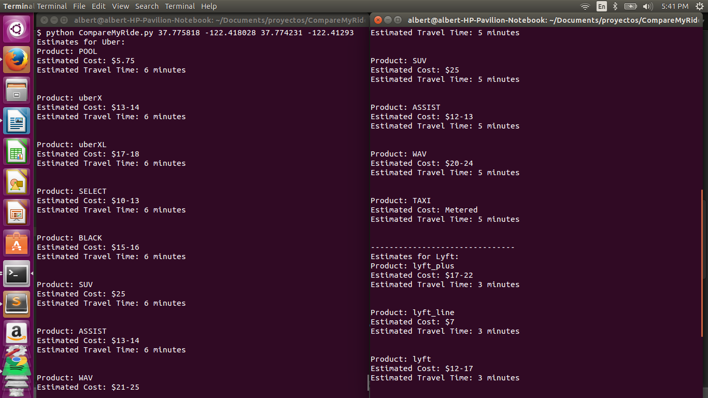

CompareMyRide is a simple Python script that compares estimates for a ride from a start point to an end point between Lyft and Uber, using their API.  Note that the distances between the start and end points has to be less than 100 miles.

In order to run the script, open terminal to where the script is and run python CompareMyRide.py start_lat start_lon end_lat end_lon

For example: python CompareMyRide.py 37.775818 -122.418028 37.774231 -122.41293

This outputs:

